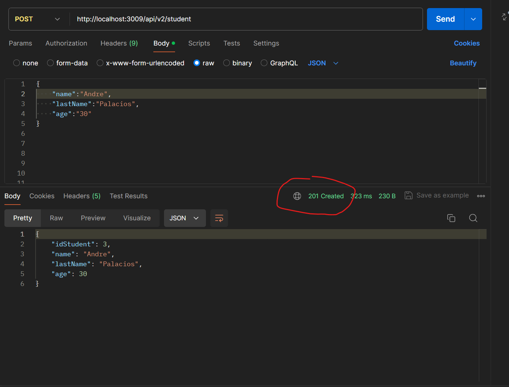

# Getting Started

### Requisitos

Tener instalado docker

Tener instalado postman

Tener instalado Table Plus

## Una vez clondo el proyecto correr en la consola
`mvn clean package`

`docker-compose build`

`docker-compose up -d`

Despues de eso abrir el table plus y agregar una nueva conexion y seleccionar la base de datos Mysql

dsps conectarlo en el puerto `5800` como se ve en esta imagen de abajo y en el nombre de la base de datos poner `db_school`

User : `root`

Password:`1234`

Por ultimo darle connect

y si todo sale bien tendreis que ver la tabla estudiante como se aprecia aqui

### Ahora para probar nuestra API Abrir postman y solicitar un metodo post en el cual la url es esta `http://localhost:3009/api/v2/student` y en el body se pondra lo siguiente

`{
"name":"Andre",
"lastName":"Palacios",
"age":"40"
}`

### Si todo salio bien les devolver un estado 201 created como podemos observar en la foto

### Recargamos nuestro tablePlus Y si todo salio bien deberiamos ver la informacion en nuestra base de datos

